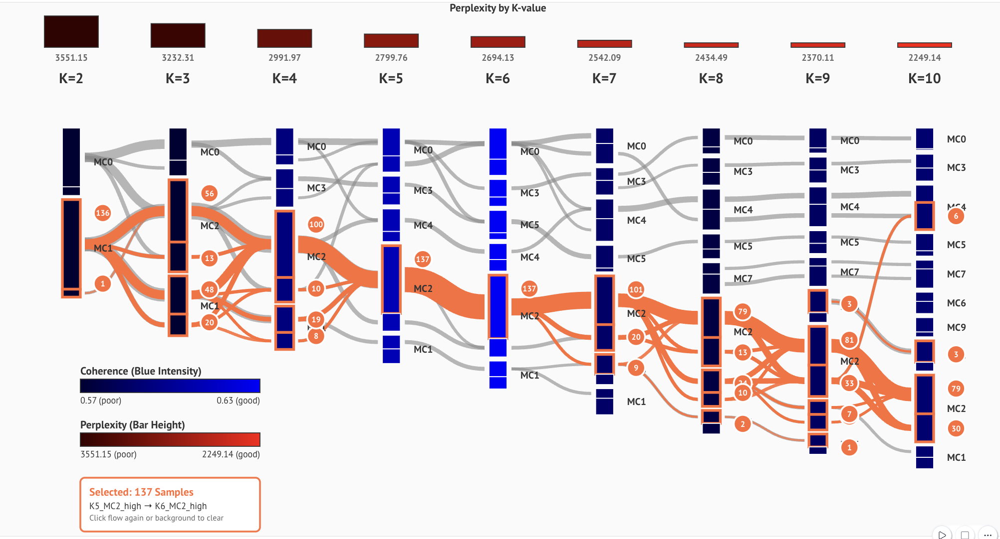

# lda4microbiome

A Python library for exploratory data analysis of microbiome data using Latent Dirichlet Allocation (LDA). The library provides a complete pipeline — from raw sequence count tables to interactive visualisations — designed for microbiome researchers.

## Overview

LDA is recognised as a "topic modelling" technique in natural language processing, but it serves as both dimensionality reduction and clustering when applied to microbial datasets. Its underlying Dirichlet distribution naturally handles the compositional nature of microbiome data. In this library, LDA topics are called **Microbial Components (MCs)** — each MC is a distribution over microbial features, and each sample is modelled as a mixture of MCs.

Two practical challenges motivated this library:

1. **Choosing *k***: LDA requires the number of MCs as input. Metrics like perplexity and coherence can guide the choice, but manual inspection of how samples behave across candidate models is still essential.
2. **Interpreting results**: Microbiome researchers need visualisations that connect LDA outputs to domain knowledge — metadata, taxonomy, and sample groupings.

`lda4microbiome` addresses both through a novel interactive visualisation called the **StripeSankey diagram** and a set of annotated heatmaps.

## Installation

```bash
pip install lda4microbiome
```

Source code and example notebooks are available at:
[https://gitlab.kuleuven.be/aida-lab/projects/LDA4Microbiome_Workflow](https://gitlab.kuleuven.be/aida-lab/projects/LDA4Microbiome_Workflow)

## Workflow

```
ASV_count.csv + taxonomy.csv + metadata.csv
        ↓  Step 1: TaxonomyProcessor
    Preprocessed intermediate files
        ↓  Step 2: LDATrainer (Gensim VB or MALLET MCMC)
    Per-k model outputs (MC–sample probability matrices, metrics)
        ↓  Step 3: SankeyDataProcessor → StripeSankeyInline
    Interactive StripeSankey diagram (model selection)
        ↓  Step 4: LDAModelVisualizerInteractive
    Annotated heatmaps, stacked bar charts, MC–feature heatmap
```

## Quick Start

```python
from lda4microbiome import (
    TaxonomyProcessor,
    LDATrainer,
    SankeyDataProcessor,
    StripeSankeyInline,
    LDAModelVisualizerInteractive,
    MCComparison,
)
```

## Step-by-Step Usage

### Step 1 — Data Transformation

The `TaxonomyProcessor` converts raw ASV count data and taxonomy tables into LDA-compatible format. Inputs must be CSV files:

- **ASV table**: rows = samples, columns = ASV features, values = raw counts (not relative abundances)
- **Taxonomy table**: rows = ASV IDs, columns = taxonomic levels
- **Output directory**: an existing folder for storing all generated files

```python
processor = TaxonomyProcessor(
    asvtable_path="data/ASV_count.csv",
    taxonomy_path="data/new_taxa.csv",
    base_directory="lda_output/"
)
results = processor.process_all()
```

### Step 2 — Training LDA Models

`LDATrainer` supports two implementations:

- **VB (variational Bayesian)** via `gensim` — faster, good for exploration
- **MCMC** via `MALLET` — slower but often more accurate; requires downloading MALLET separately

Models are trained across a range of *k* values (default: 2–20). Results are saved to the output folder.

```python
trainer = LDATrainer(
    base_directory="lda_output/",
    implementation="MCMC",           # or "VB"
    path_to_mallet="path/to/mallet"  # required for MCMC only
)
lda_results = trainer.train_models(MC_range=range(2, 11))
```

### Step 3 — Model Selection with StripeSankey

Process training results into the StripeSankey format, then launch the interactive widget to explore all candidate models at once.

```python
processor_sankey = SankeyDataProcessor.from_lda_trainer(trainer)
sankey_data = processor_sankey.process_all_data()

widget = StripeSankeyInline(
    sankey_data=sankey_data,
    width=1400,
    height=700,
    mode="metrics"
)
widget  # display in a marimo notebook
```



The StripeSankey diagram is designed to diagnose a core modelling question: **should a meaningful sample group be explained by multiple specialised topics, or one comprehensive topic?** It shows all candidate *k* values side by side, so you can see globally how samples split and merge as *k* increases, then click any flow to trace exactly which samples are moving and where they go.

#### Investigating splitting flows with MCComparison

```python
mc_comp = MCComparison(
    base_directory="lda_output/",
    metadata_path="data/metadata.csv"
)
mc_comp.compare_two_mcs("K4_MC0", "K4_MC1", metadata=["Country", "Breed_type"])
```

### Step 4 — Result Interpretation

Once a *k* value is chosen, `LDAModelVisualizerInteractive` generates a full set of visualisations saved as SVG, PNG, and HTML.

```python
viz = LDAModelVisualizerInteractive(
    base_directory="lda_output/",
    k_value=4,
    metadata_path="data/metadata.csv",
    universal_headers=["Country", "Breed_type"],   # categorical metadata columns
    continuous_headers=["Age"]                      # numerical metadata columns
)
viz_results = viz.create_all_visualizations_interactive()
```

**Visualisations produced**:

| Plot | Description |
|------|-------------|
| **Sample–MC heatmap** | Annotated heatmap with metadata bars and dendrogram. Use hover to inspect individual samples and their metadata. Use the dendrogram to select precise sample groups. |
| **Stacked bar charts** | Samples grouped by metadata; bars show MC mixture proportions. Useful for comparing enterotype-like groups. |
| **MC–feature heatmap** | Interactive heatmap of the MC × ASV matrix. Hover tooltips include taxonomy annotations at all levels and per-MC probabilities. |

## Citation

The StripeSankey diagram and sample–MC heatmap were developed in the context of the following studies. If you use this library, please consider citing the relevant work.

**Pig gut microbiota study** (data used in the StripeSankey figure above; also applies the sample–MC heatmap exploration):

Comer, L., Huo, P., Colleluori, C., Zhao, H., Akram, M. Z., Kpossou, R. F., Sureda, E. A., Aerts, J., & Everaert, N. (2026). From forest to farm: the impact of a broad spectrum of lifestyles on the porcine gut microbiota. *Current Research in Microbial Sciences*, 100576.
[https://www.sciencedirect.com/science/article/pii/S2666517426000313](https://www.sciencedirect.com/science/article/pii/S2666517426000313)

**Tomato hairy root disease study** (also applies the sample–MC heatmap exploration):

Huo, P., Vargas Ribera, P., Rediers, H., & Aerts, J. (2025). Latent Dirichlet Allocation reveals tomato root-associated bacterial interactions responding to hairy root disease. *Environmental Microbiome*.
[https://link.springer.com/article/10.1186/s40793-025-00822-2](https://link.springer.com/article/10.1186/s40793-025-00822-2)

## Authors

- **Peiyang Huo** (peiyang.huo@kuleuven.be) — AIDA Lab, KU Leuven
- Luke Comer — NAMES Lab, KU Leuven
- Pablo Vargas — IRTA Cabrils
- Hans Rediers — KU Leuven
- Nadia Everaert — KU Leuven
- Jan Aerts — AIDA Lab / Leuven.AI, KU Leuven (corresponding author)
